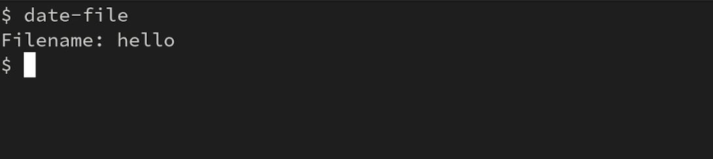

# Date File

[](https://snapcraft.io/date-file)
[](https://snapcraft.io/date-file)


A simple bash app, designed to create new files with the date in the file name in YYYY-mm-dd format. It has only terminal interface.

# Installation

You can install Date-File through the [Snapstore](https://snapcraft.io/#), running this command.

```bash
$ sudo snap install date-file
```

# Usage

Once  installed, to use it you will need to write "file-date" on the prompt, and you will be asked the filename. 




Or if you prefer it you can introduce de filename after "file-date" command on this way (in this way you can't introduce spaces on the file name)

```
$ date-file meeting-notes.txt
```

# Alias 

If you love and you use a lot "date-file", but you are tired of writing the full command, you can create an alias with the following command.
```
$ sudo snap alias date-file dat
```
From now on to execute "date-file" you will only need to execute "dat". Before creating the alias be sure that you do not have a app that already use this command.

# Uninstallation

If you are tired of date-file, you can uninstall it with this command

```
sudo snap remove date-file
```

# License

This project is licensed under the MIT License - see the [LICENSE](LICENSE) file for details

# Video Demo

[YouTube Video](https://youtu.be/OibocYofjqc)


[](https://snapcraft.io/date-file)

